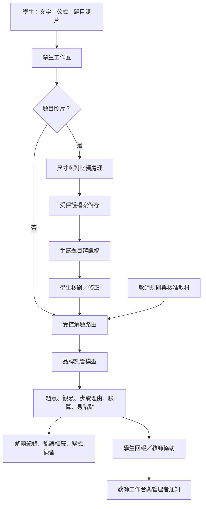

# 國中數學解題教練：系統運作與發布指南

本文件說明目前第一版系統的實際運作方式，目的是讓教師能理解學生送出題目後發生的資料流程、教師工作台如何影響解題回覆，以及每次更新如何被保存與發布。

## 一、系統由哪些部分組成

| 層級 | 主要位置 | 工作內容 |
|---|---|---|
| 學生工作區 | `client/src/pages/Home.tsx` | 選擇年級、單元與三種解題模式；輸入文字、數學式或題目照片；閱讀回覆與建立錯題循環。 |
| 公式輸入 | `client/src/components/MathFormulaEditor.tsx` | 透過可視化數學欄位與分數、根號、次方、括號等快捷鍵建立 LaTeX 公式，再隨題目安全傳送。 |
| 手寫題目流程 | `client/src/pages/Home.tsx`、`server/routers/tutor.ts` | 前端先調整圖片尺寸與對比、檢查基本品質；後端以短效圖片連結交由受控視覺模型轉寫，讓學生可修正辨識稿。 |
| 受控解題引擎 | `server/tutor/engine.ts`、`server/routers/tutor.ts` | 組合教師規則、核准教材與安全限制，呼叫品牌託管模型，並要求固定的結構化回覆。 |
| 教師工作台 | `client/src/pages/TeacherWorkspace.tsx` | 維護單元規則、核准教材內容，並檢視與處理學生回報案件。 |
| 資料與權限 | `drizzle/schema.ts`、`server/tutor/db.ts` | 保存學生解題、附件參照、錯誤標籤、變式練習與教師案件；所有學生資料依登入帳號隔離。 |

## 二、學生解題時如何運作

學生會先選擇七、八或九年級、核心單元，以及「引導解題」、「逐步教學」或「驗算訂正」。這三個選項不是只改變介面文字，而是會一併送至後端，決定解題引擎給提示、完整步驟或檢查學生過程的方式。

送出後，伺服器會讀取該年級與單元的**教師核准規則與教材內容**，將它們與安全限制合併為模型指令。模型不會直接自由回答，而必須回傳指定欄位：題意重述、關鍵觀念、每一步的理由與算式、驗算、易錯點、信心指標、是否需要補充，以及一題變式練習。後端會檢查回覆結構；若資訊不足或信心偏低，畫面會要求學生補充文字或重新拍照，而不是假裝答案可靠。

## 三、公式與手寫題目如何改善輸入體驗

公式編輯器位於學生輸入區的「開啟公式編輯器」。學生可在可視化欄位直接輸入，或點選分數、根號、次方、括號、等號與 π 快捷鍵。系統保存的是 LaTeX 表示法，因此分數結構、指數與根號不會因為純文字輸入而遺失。

題目照片先在瀏覽器端做不涉及內容判斷的預處理：限制最長邊、建立白色背景、微幅提升對比與亮度，並以解析度與亮暗／對比訊號提示是否適合辨識。原始照片不會寫入資料表；系統只保存物件儲存的檔案參照。辨識時，伺服器取得短效存取連結，要求受控視覺模型只做轉寫、不解題。辨識稿會以可編輯欄位回到學生面前；學生需要特別核對數字、分數線、根號、等號與指數。低信心時，系統會保守地提示補拍範圍或補充文字。

## 四、教師工作台如何影響學生回覆

教師工作台位於 `/teacher`，並由管理者角色保護。管理者可將自己的教學方法填入「單元教學規則」，例如先確認未知數、要求說明等式兩邊為何能同時運算、最後代回原式驗算。每次儲存會形成版本；只有勾選「核准」的規則才會進入學生解題上下文。

教師也可以在同一頁新增「核心觀念」、「示範題」、「常見迷思」或「教學規準」內容。這些內容同樣有核准狀態，並且依所屬單元提供給解題引擎作為參考。工作台右側會列出學生提出的答案疑慮、照片不清楚或教師協助案件。教師可將案件從待處理改為檢查中，最後標示已結案；高優先案件建立時會同時觸發管理者通知。

## 五、安全與資料保存原則

| 機制 | 實際做法 |
|---|---|
| 品牌託管模型 | 模型呼叫僅在伺服器端執行。學生介面沒有第三方 API Key，也不會把金鑰儲存在瀏覽器。 |
| 請求與每日限額 | 每位學生的當日解題／辨識用量會在伺服器端計數。超過限制時直接拒絕，不再發出模型呼叫。 |
| 題目照片 | 只接受 JPEG、PNG 與 WebP，大小上限為 5MB；檔案存放於物件儲存，資料庫保存其參照與辨識狀態。 |
| 權限分離 | 學生只能讀寫自己的對話、附件、練習與回報；教材、規則與案件處理 API 僅開放管理者。 |
| 可靠性提醒 | 所有解題回覆均包含「AI 可能出錯」的核對提醒；低信心或題目不完整時，流程優先要求澄清。 |

## 六、程式碼閱讀順序

若要自行理解或延伸系統，建議按照下列順序閱讀：

1. 從 `client/src/pages/Home.tsx` 看學生如何提交文字、公式與照片。
2. 接著閱讀 `server/routers/tutor.ts`，了解上傳、辨識、解題、回報與教師 API 的輸入驗證與權限控制。
3. 再閱讀 `server/tutor/engine.ts`，了解固定解題格式、安全規則與教師內容如何組成模型指令。
4. 閱讀 `server/tutor/db.ts` 和 `drizzle/schema.ts`，掌握資料如何被保存及查詢。
5. 最後查看 `client/src/pages/TeacherWorkspace.tsx`，了解教師如何新增教材、調整規則與處理案件。

## 七、如何發布與回復版本

此專案使用受管發布流程。每次功能完成後會先執行 `pnpm test`、`pnpm check` 與 `pnpm build`；前兩者分別確認自動化行為與 TypeScript 型別，最後一者確認正式前端與伺服器可以打包。通過後建立專案版本檢查點。此專案已啟用自動發布，因此**成功建立檢查點即會將該版本發布到正式網域**。

目前正式網域為：[https://junmathbot-786ett3p.manus.space](https://junmathbot-786ett3p.manus.space)。之後若修改失敗，可在版本紀錄選擇先前的檢查點回復。回復程式與設定不會自動回復已存在的學生資料，因此涉及資料庫欄位刪除或資料重整時，應先另行備份並審核。

## 八、本次建置優化

原本的回覆呈現依賴會使正式建置需要處理過多前端模組。在不降低解題回覆可讀性的前提下，系統已改用安全且輕量的固定 Markdown 子集呈現器，並將教師工作台與完整錯題本改為按需載入。正式建置已成功完成，輸出包含學生首頁主程式、錯題本分塊與教師工作台分塊；學生首次進入首頁不需先下載教師管理頁程式。
